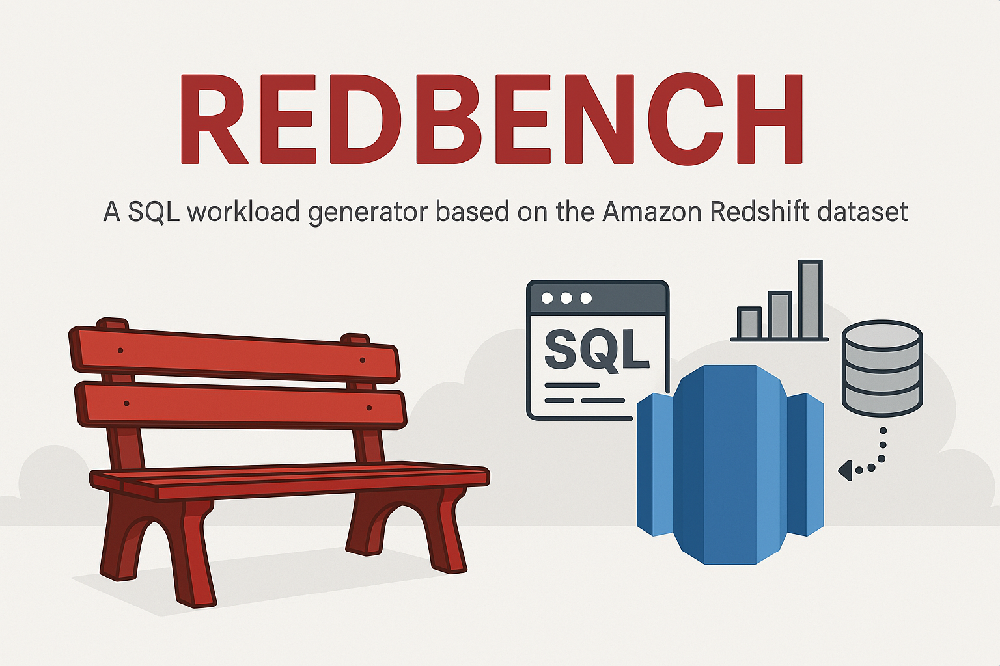

[](https://www.python.org/downloads/)
[](LICENSE)
[](https://github.com/astral-sh/uv)
[](https://github.com/astral-sh/ruff)
[]()
<!-- []() -->

# Redbench - Workload Synthesis From Cloud Traces


**A TU Darmstadt & UTN Workload Generator based on Redset**

Sourcecode of the paper *Redbench:  Workload Synthesis From Cloud Traces*
<!-- The sourcecode for the evaluation sections of *Redbench* can be found here [https://github.com/DataManagementLab/Redbench-Eval](https://github.com/DataManagementLab/Redbench-Eval). -->

## Overview
Redbench is a flexible workload generator for database benchmarking, supporting both query matching and synthetic workload generation.
It is designed to mimic real-world workloads (e.g., from Redset) and supports integration with custom database schemas.
Example datasets and plots are provided for quick evaluation.

## Features
- Generate workloads using both matching and synthetic generation strategies
- Supports SELECT, INSERT, UPDATE, DELETE queries
- Works with custom database schemas and data
- Includes example datasets (IMDB & Baseball) and evaluation plots
- Easy setup with [uv](https://github.com/astral-sh/uv/)

## Quickstart
1. **Install uv** (if not already installed):  
    For an easy and hassle free python experience we use uv.
    Please install via `curl -sSf https://astral.sh/uv/install.sh | sh` or follow the instructions on [https://github.com/astral-sh/uv](https://github.com/astral-sh/uv).
    UV will ship its own python versions, hence no additional python setup is necessary.
   ```sh
   # On macOS and Linux.
   curl -LsSf https://astral.sh/uv/install.sh | sh
   ```
   (if you are planning not to use uv, please make sure to add `src/redbench` to your `PYTHONPATH`)
2. **Sync dependencies:**
   ```sh
   uv sync
   ```
3. **Activate environment:**
   ```sh
   source .venv/bin/activate
   ```
4. **Download Redset** (see [Redset repo](https://github.com/amazon-science/redset)). This can take a while, so be patient:
    (requires `aws`-CLI. Installation guide[here](https://docs.aws.amazon.com/cli/latest/userguide/getting-started-install.html or via python `uv add awscli` / `pip install awscli`)
   ```sh
   mkdir data
   # serverless dataset (small good for testing)
   aws s3 cp --no-sign-request s3://redshift-downloads/redset/serverless/full.parquet data/full_serverless.parquet
   # provisioned dataset (significantly larger)
   aws s3 cp --no-sign-request s3://redshift-downloads/redset/provisioned/full.parquet data/full_provisioned.parquet
   ```
<!-- 5. **Download support databases:**  
    The generation-based strategy of redbench allows generating a workload for any of your databases.
    We provide two common real-world databases (schema & data) to generate queries for. 
    Moreover, we include an example workload that we have generated.
    You can download these datasets from OSF directly using the following command:
   ```sh
   #  Change the output directory if required
   python src/redbench/download_artifacts.py --artifacts_dir output/
   ```
   By default this will download only the baseball dataset. See [below](#adding-a-custom-support-database-for-the-generation-based-strategy) for a description of the artifacts structure.
   To include the `imdb` dataset as well please add `--databases baseball imdb`
   Alternatively, you can provide a custom support database as described [below](#adding-a-custom-support-database-for-the-generation-based-strategy). -->

5. **Install system wide requirements**
   Redbench requires `duckdb`-CLI. Please install it by calling:
   ```curl https://install.duckdb.org | sh```
   <!-- Moreover, `yacc` and `flex` are required.
   ```sudo apt install byacc flex``` -->

6. **Run workload generation:**
   To configure the generation approach, please see its dedicated [README](src/redbench/generation/README.md).
   To run the workload generation, use the following command:
   ```sh
   # Change the data and output directory if required
   # Default cluster / database will be picked if not specified
   python src/redbench/run.py \
     --redset_path data/full_serverless.parquet \
     --output_dir output
   ```
   Point the output dir to the path you have downloaded the artifacts to.

## Additional Plots
To compare matching and generation based approach, use the following script to generate the plots:
```sh
python src/redbench/plots/create_multiplots.py
```

## Comparison of Generation Methods

| Criterion         | Matching                                   | Generation                                                        |
| :--------------- | :----------------------------------------- | :---------------------------------------------------------------- |
| Query Types      | SELECT / SIMPLE DML                         | SELECT / INSERT / UPDATE / DELETE       |
| Query Complexity | Complex (follows TPC-H/JOB/...)            | Many joins, simple predicates                      |
| Repetition       | Exact repetition                        | Structural & exact repetition                                     |
| Matches Redset   | Repetitions/Arrival-Times, Schema, Num-Joins (relative)                       | Repetitions/Arrival-Times, Schema, Num-Joins, Bytes-Read (relative)                           |

*Note: The generation-strategy will augment existing tables (i.e. generate more versions of that table) to allow inserts between the tables.*

## Optional Arguments
| Key                   | Description                                                                                                   | Example Value                        |
| :-------------------- |:------------------------------------------------------------------------------------------------------------| :----------------------------------- |
|`generation_strategy`  | (optional) Select strategy (`matching` / `generation`); default: both sequential                             | `matching`                          |
|`instance_id`           | (optional) Instance ID to mimic; auto-selected if not given                                                   | `42`                                |
|`database_id`          | (optional) Database ID to mimic; auto-selected if not given                                                  | `13`                                |
|`matching_config_path` | (optional) Config file for matching strategy - for quick tryout a fast config is used if not specified (`fast.json`)                | `matching/config/default.json`       |
|`generation_config_path`| (optional) Config file for generation strategy  - for quick tryout a fast config is used if not specified (`fast.json`)                                     | `generation/config/default.json`     |

## Configuring Matching & Generation
Configuration files are located in the following directories:
- Matching: `src/redbench/matching/config/`
- Generation: `src/redbench/generation/config/`

For detailed documentation on the tuning parameters, refer to the following resources:
- [Generation Configuration](./src/redbench/generation/README.md)
- [Matching Configuration](./src/redbench/matching/README.md)

By default, the `fast.json` configuration is utilized, which prioritizes speed over accuracy for quick trials. The original configuration used in the paper is available in `default.json`.


## Adding a Custom Support Database for the generation-based strategy
To generate queries on your own database, provide:
- Table data as CSV files (`tablename.csv` for each table)
- A Postgres/DuckDB-compatible schema definition (e.g., `postgres.sql`)
- A `schema.json` file with:
    - `csv_kwargs`: Dict of CSV parsing args (e.g., separator)
    - `relationships`: all join paths that the generator should be allowed to use. This can include pk/fk columns as well as all other columns that are joinable. It should be formatted as list of tuples of (table1, col1, table2, col2) where col1 and col2 can also be a list of columns in case of composite keys.
    - `table_col_info`: a dictionary (->table->col->stats) listing for each column its datatype (`type`) and if it is a primary key (`pk`)

Please store the `postgres.sql` and `schema.json` file under `<artifacts_dir>/generation_based/<your_db_name>`.

Edit the `config.json`:
- `database_name`: `<your_db_name>`
- `raw_database_tables`: `<path/to/your/base_tables>`

All preprocessing steps (parsing the csv files, doing some internal data preparation, generating some additional CSVs to increase the number of tables in the schema, ...) will be done automatically the first time a new dataset is used.
If you are not interested in automatically deriving additional tables, set the `num_split` knob of the config file to 1.

## Round-Robin Baseline
To generate the round-robin baseline which is based on traditional benchmarks execute this command:

```sh
python src/redbench/baseline/round_robin.py  --output_dir output --support_benchmark {database_name} --redset_dataset provisioned --redset_path path/to/redset/provisioned/full.parquet --instance_id 186 --database_id 8 --start_date "2024-05-01 00:00:00" --end_date "2024-06-01 00:00:00"
```

It will automatically extract the number of queries and the read-write ratio from the specified redset cluster / timeframe and produce the workload.

## Support
For questions or issues, please open an issue on GitHub or contact the maintainers.

---

*This project is developed by TU Darmstadt & UTN. See the [Redset project](https://github.com/amazon-science/redset) for more information on the reference workload.*
